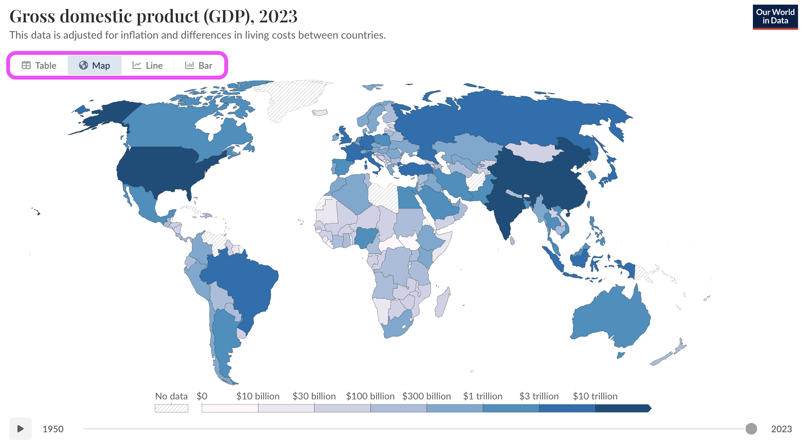

```{r setup}
#| label: load-pkgs
#| message: false
#| echo: False

if (!require("pacman"))
  install.packages("pacman")

pacman::p_load(tidyverse, here, countdown, tidytuesdayR, lubridate, 
               janitor, showtext, scico, DT, readr, ggridges, sf,
               ggmap, leaflet, mapproj, geofacet, glue)

# theme
ggplot2::theme_set(ggplot2::theme_minimal(base_size = 14))
options(width = 65)

# figure defaults
knitr::opts_chunk$set(
  fig.width = 7,
  fig.asp = 0.618,
  fig.retina = 3,
  fig.align = "center",
  dpi = 300
)

```

## Dataset - The Languages of the World

[TidyTuesday](https://github.com/rfordatascience/tidytuesday/blob/main/data/2025/2025-12-23/readme.md) \| [Glottolog Github](https://github.com/glottolog/glottolog)

```{r}
#| label: load-dataset
#| message: false
#| echo: False

tuesdata <- tidytuesdayR::tt_load('2025-12-23')

# Primary datasets
endangered_status <- tuesdata$endangered_status
families <- tuesdata$families
languages <- tuesdata$languages

# Base, pre-cleaned data set underlying families and languages sets
fam_lgs <- 
  readr::read_csv("https://raw.githubusercontent.com/glottolog/glottolog-cldf/refs/heads/master/cldf/languages.csv")
```

There are three primary datasets from TidyTuesday, each of which are derived from [Glottolog](https://glottolog.org/), which is an open-access linguistics database.

The focus of the data are the languages spoken across the world. Primarily where they are spoken (both in terms of macroarea and lat/lon coordinates), and which families they belong to. Beyond that, and maybe the most pointed data, are the endangered statuses of these languages, based on a six-point scale called the [Agglomerated Endangerment Scale (AES)](https://glottolog.org/langdoc/status), which is as follows:

|   **AES status**   | AES Status Code | **\# of languages** | **% of languages** |
|:----------------:|:----------------:|:-----------------:|:----------------:|
| **not endangered** |        1        |        2770         |       35.34%       |
|   **threatened**   |        2        |        1565         |       19.96%       |
|    **shifting**    |        3        |        1799         |       22.95%       |
|    **moribund**    |        4        |         421         |       5.37%        |
| **nearly extinct** |        5        |         300         |       3.83%        |
|    **extinct**     |        6        |         984         |       12.55%       |
|     **total:**     |                 |        7839         |                    |

Note: The 'families' and 'languages' datasets are derived from 'fam_lgs', using the following script provided by TidyTuesday:

``` {.r fold="True"}
# Imports
library(tidyverse)

# Download raw data and filter to endangered status
endangered_status <- 
  readr::read_csv("https://raw.githubusercontent.com/glottolog/glottolog-cldf/refs/heads/master/cldf/values.csv") |> 
  dplyr::filter(Parameter_ID == "aes") |> 
  dplyr::select(Language_ID, Value, Code_ID) |> 
  dplyr::rename(id = Language_ID,
                status_code = Value,
                status_label = Code_ID) |> 
  dplyr::mutate(status_label = stringr::str_replace(stringr::str_remove(status_label, "^aes-"), "_", " "))

# Download language and family data
fam_lgs <- 
  readr::read_csv("https://raw.githubusercontent.com/glottolog/glottolog-cldf/refs/heads/master/cldf/languages.csv")

# Filter and clean language family data
families <- 
  fam_lgs |> 
  dplyr::filter(Level == "family") |> 
  dplyr::select(ID, Name) |> 
  dplyr::rename(Family = Name) |> 
  dplyr::rename_with(stringr::str_to_lower, dplyr::everything())

# Filter and clean language data
languages <- 
  fam_lgs |> 
  dplyr::filter(Level == "language") |> 
  dplyr::select(ID, Name, Macroarea, Latitude, Longitude, ISO639P3code, Countries, Is_Isolate, Family_ID) |> 
  dplyr::rename_with(stringr::str_to_lower, dplyr::everything())
```

### Supplementary Data

- World Bank Group Data
  - File name: `GDP_by_country_time.csv`

    - Global Gross Domestic Product (GDP) change, year over year (since 1960) \| Source: [World Bank Group](https://data.worldbank.org/indicator/NY.GDP.MKTP.KD.ZG?end=2024&start=1960&view=chart)
- UN Data
  - File name: `un_developing_countries_data.csv`
    - List of Least Developed Countries (LDCs) \| Source: [United Nations](https://www.un.org/ohrlls/content/list-ldcs)

    - List of Landlocked Developing Countries (LLDCs) \| Source: [United Nations](https://www.un.org/ohrlls/content/lldcs-national-reports)

    - List of Small Island Developing States (SIDs) \| Source: [United Nations](https://www.un.org/ohrlls/content/list-sids)
  - File name: `unpopulation_dataportal.csv`
    - Population data by country since 1960 for two variables \| Source: [United Nations](https://population.un.org/dataportal/home?df=6b74dd77-07a5-4cfc-91c1-0ed3c86d2b58)

      - Population density

      - Populating change

```{r supplemental-data}

# Gross domestic product
gdp <- 
  readr::read_csv("data/GDP_by_country_time.csv", skip = 4)

# United Nations' developing countries list
dev_countries <- 
  readr::read_csv("data/un_developing_countries_data.csv")

# Population change and density data by country
pop <- 
  readr::read_csv("data/unpopulation_dataportal.csv")
```

## Analysis Details

I was a linguistics major in undergrad, so languages are naturally interesting to me, but I know very little about how languages intersect with geography. To that end, I'm hoping to do some exploratory analysis alongside of the set questions listed here.

'Patterns' could be interpreted many ways, so while I want to keep an open mind, here area at least two questions I want to explore.

### Question 1 - Global Patterns

1.  What geographic patterns exist for endangered languages around the world? Specifically:
    1.  What relationship exists between a language's isolate status and its endangered status?
    2.  Which language families span the widest geographic range?

#### Data Wrangling

1.  Create `master_languages` dataframe
    1.  left_join `endangered_status` on (language) `id`
        1.  `status_code`
        2.  `status_label`
    2.  left_join `families` on `languages$family_id` and `families$id`

#### Variables

| **\#** | **Variable** | **Type** | **Source** | **Notes** | Used For? |
|:----------:|:----------:|:----------:|:----------:|:----------:|:----------:|
| 1 | Language | Categorical | **`languages`** | Individual language name | Both |
| 2 | Macroarea | Categorical | **`languages`** | Africa, Americas, Australia, Eurasia, Pacific, South America | Both |
| 3 | Country | Categorical | **`languages`** | Join key for supplementary datasets | Both |
| 4 | Latitude / Longitude | Numerical | **`languages`** | Geographic coordinates for map placement | Both |
| 5 | Family ID | Categorical | **`languages`** | Links to families dataset | Part 2 |
| 6 | Is Isolate? | Categorical (Boolean) | **`languages`** | True if language belongs to no known family | Part 1 |
| 7 | Endangered Status Label | Categorical (Ordinal) | **`endangered_status`** | not endangered → threatened → shifting → moribund → nearly extinct → extinct | Part 1 |
| 8 | Endangered Status Code | Numerical (Ordinal) | **`endangered_status`** | AES scale 1–6 | Part 1 |
| 9 | Landlocked Developing Country (LDC) Designation | Categorical (Boolean) | **`un_developing_countries_data`** | UN classification; joined at country level | Part 1 |
| 10 | Small Island Developing Country (SID) Designation | Categorical (Boolean) | **`un_developing_countries_data`** | UN classification; joined at country level | Part 1 |
| 11 | Global Reach | Numerical | **`languages`** | Custom calculated metric[^1] | Part 2 |

[^1]: Global reach = Geographic area, measured in latitude and longitude, covered by speakers of the language

#### Visualization

The obvious choice here is a world map, but the reach goal is to create a tabular visualization of the same dataset that allows for different perspectives of the same data. I think this is especially useful when describing/surveying patterns in data. I expect to product something akin to this, but I'm not married to table, line, and bar charts as the alternative views:

{width="527"}

#### Expectations

1.  Isolate languages will be more likely to be endangered than non-isolates.
2.  Isolate languages will be more commonly found on island countries versus land-locked countries.
    1.  Supplementary Data: `un_developing_countries_data.csv`
3.  Child languages of English and Spanish will have the widest global reach.

#### Limitations

I think the key challenge here is my lack of experience with geographic visualizations. This is largely why I chose the topic in the first place, though, and 'Visualizing geospatial data' lectures are timely. Beyond that, cleanly defining 'global reach' and 'land-locked countries' will be important.

### Question 2 - Shifting Socioeconomically vs. Shifting Linguistically

1.  What relationship exists between shifting/endangered languages and:
    1.  Population change over the last 20 years
    2.  Change in GDP over the last 20 years

Endangered Status is qualitative by nature but also includes a numeric scale. Rather than create custom metrics using the AES scale, I'm going to lean on supplementary data (*italicized* below) for my quantitative analysis.

#### Data Wrangling

1.  Create `master_countries` dataframe
    1.  Begin with `master_languages` dataframe
    2.  Filter for
    3.  left_join `families` on `languages.family_id` and `families.id`

#### Variables

| **\#** | **Variable** | **Type** | **Source** | **Notes** | Used For? |
|:----------:|:----------:|:----------:|:----------:|:----------:|:----------:|
| 1 | Language | Categorical | **`languages`** | Individual language name | Both |
| 3 | Country | Categorical | **`languages`** | Join key for supplementary datasets | Both |
| 4 | Latitude / Longitude | Numerical | **`languages`** | Geographic coordinates for map placement | Both |
| 5 | Family ID | Categorical | **`languages`** | Links to families dataset | Both |
| 7 | Endangered Status Label | Categorical (Ordinal) | **`endangered_status`** | not endangered → threatened → shifting → moribund → nearly extinct → extinct | Both |
| 8 | Endangered Status Code | Numerical (Ordinal) | **`endangered_status`** | AES scale 1–6 | Both |
| 9 | Population change over the last 20 years | Numerical | `unpopulation_dataportal` | Year-over-year population change by country; joined at country level | Part 2 |
| 10 | Change in GDP over the last 20 years | Numerical | `GDP_by_country_time` | Year-over-year GDP change by country; joined at country level | Part 2 |

#### Visualization

Even though I don't have endangered status data over time (see: limitations), I still plan to incorporate time series/trend visuals for change in GDP and population. The goal is combine change over time and categorical data (endangered status today) in a way that's equally meaningful and intuitive.

#### Expectations

1.  The highest concentration of `shifting` languages will be in countries/areas that have seen the most recent decline in population.
2.  `shifting`, `moribund`, and `endangered` languages will roughly follow Pareto's rule in relation to GDP. That is, roughly 80% of the world's least spoken languages will exist in countries/areas that make up less than 20% of the world's GDP.

#### Limitations

As mentioned, I wasn't able to find past/trending endangered status data, only the current statuses for languages. This would have been especially useful to show trending over time via time lapse or otherwise. As a solution, I'm going to focus on the last two decades (2005-2025) as a measure of how much a country/macroarea is changing in population and GDP. Then I plan to use that data to compare against the static AES values of `shifting`, `moribund`, and `endangered`.

### Project Timeline

|  Week  |              Deliverable               |   Deadline    |   Status    |
|:----------------:|:----------------:|:----------------:|:----------------:|
| Week 1 |        Proposal + Peer Reviews         | June 12, 2026 | In Progress |
| Week 2 |       Data Wrangling + Mutation        | June 19, 2026 | In Progress |
| Week 3 |     Visualizations + Begin Writeup     | June 26, 2026 | Not Started |
| Week 4 | Complete Writeup + Record Presentation | July 3, 2026  | Not Started |
